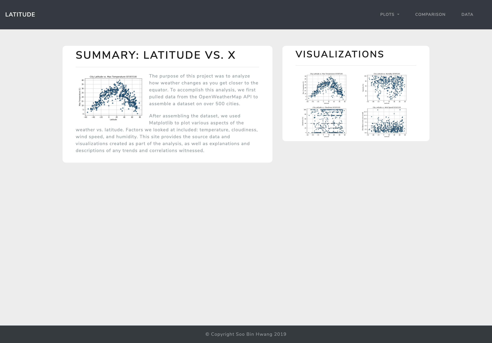
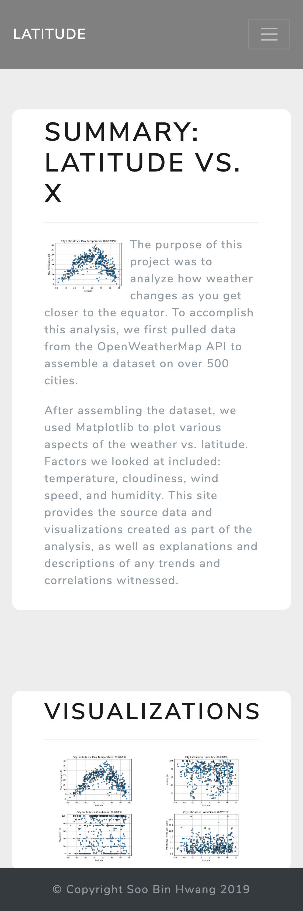

# Weather Factors vs. Location Dashboard
This website showcases a web visualization dashboard using data collected for __*Weather Factors vs. Location*__ (https://github.com/soobing91/A6_Weather_Analysis.git).

Enter the dashboard by clicking [here](https://soobing91.github.io/A9_Weather_Web/index.html). This website is created by HTML5, Bootstrap, and CSS. For codes, refer to `index.html` and html documents stored in Pages folder.

The following screenshots display each page of the web dashboard on both full-screen and responsive modes.

